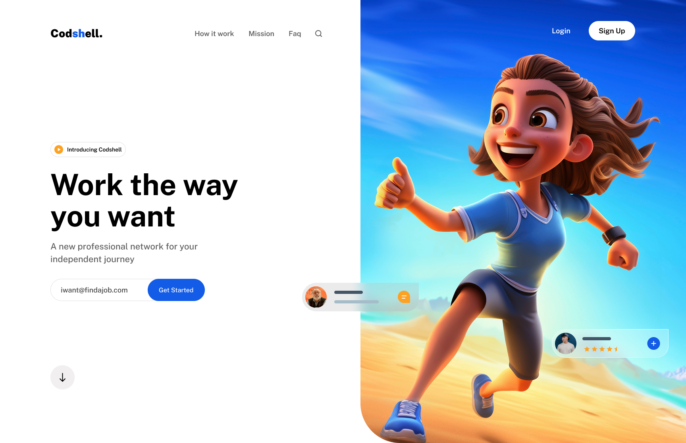

# Codshell — Modern & Minimal Hero 

#

- Este repositorio contiene la implementación técnica de una interfaz de alta fidelidad, traduciendo un diseño conceptual de Figma Community a un entorno funcional utilizando tecnologías modernas de frontend.
- ✨ Modern & Minimal Hero Layouts
- 🎨 Clean Landing Page UI
- 🚀 Figma to Frontend: Hero Sections

## 🛠️ Tecnologías utilizadas
- Vite
- React
- TypeScript
- TailwindCSS
- Figma Community (diseño base)

## 🙌 Créditos
- **Diseño original:** [dsingr](https://www.figma.com/@dsingr) en Figma Community  
- **Archivo de diseño:** [Ver en Figma](https://www.figma.com/community/file/1470386647617764578/figma-ui-design-create-website-hero-section-in-simple-way)  
- **Implementación frontend:** Luis Arteaga (este repositorio)